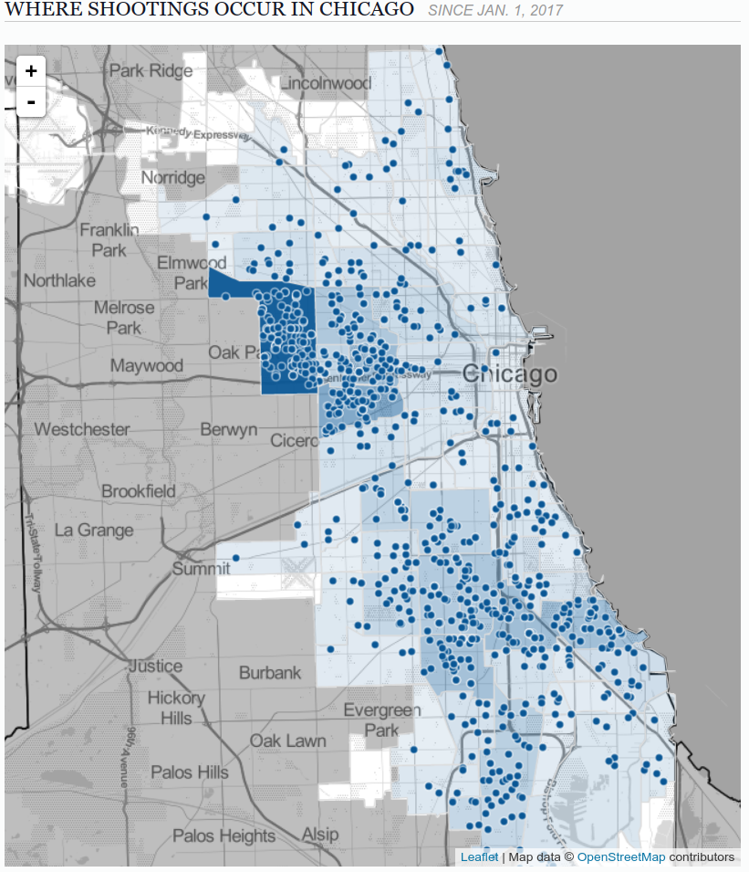
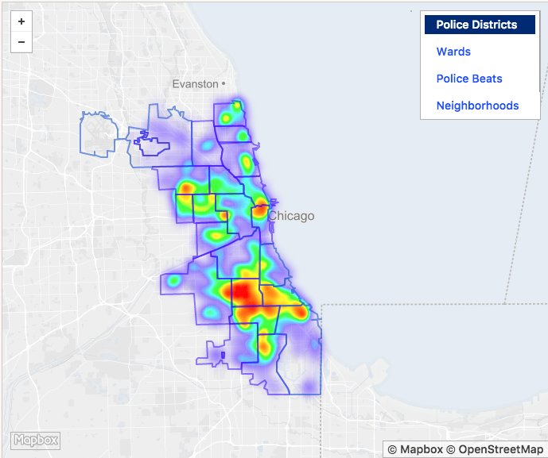

# Chicago and its crimes

Chicago community areas. Source: [http://maps-chicago.com/img/0/chicago-neighborhood-map.jpg](http://maps-chicago.com/img/0/chicago-neighborhood-map.jpg)

## Background

Chicago is notorious for its violent crime rate, topping many major US city in violent crimes [1]. 

Crimes are usually not evenly distributed across a city, and a person who might be interested in moving to Chicago would probably want to see which areas are the worst inside Chicago. Based on that data, a new would-be resident could compare between areas inside Chicago and choose a more crime-free district to live. The data about these bad areas also gives insight into the police department and helps in pinpointing crime clusters, which are often formed due to sociological differences i.e. poverty and education. 

Taking a look at just the shootings that happened during this year in Chicago shows couple of these clusters 

Source: [http://crime.chicagotribune.com/chicago/shootings](http://crime.chicagotribune.com/chicago/shootings)

Tackling these crime clusters would make the city safer, even though there might be internal problems [in the police department](http://www.reuters.com/article/us-chicago-police/chicagos-detective-force-dwindles-as-murder-rate-soars-idUSKCN10Z13A). Another problem are [guns](http://edition.cnn.com/2017/01/02/us/chicago-murder-rate-2016-visual-guide/index.html) which are hard to get rid of or to even regulate, even with strict gun laws.

However, data about crime types and counts provides valuable information about the current state of crimes in Chicago. We believe that smaller crimes create a *butterfly effect* which will ultimately reflect to more serious crimes over time.

The data we use are non-homicide crimes from 2010 to 2016 and school inquiries/statistics to form a forecast for 2017. This raises couple of questions that could be answered
* How the crime rate in Chicago will change in the future?
* How the crimes are distributed inside Chicago?
* Does there exists a possible relationship to education?

[1] https://www.usnews.com/news/articles/2016-09-19/chicago-drives-uptick-in-murders-national-crime-rate-stays-near-historic-lows

## Data

We use data from 2010 to 2016 offered by [the city of Chicago](https://data.cityofchicago.org/Public-Safety/Crimes-2001-to-present/ijzp-q8t2). There are over 2 million rows in our filtered data set.
Every row contains at least the crime type, date, latitude and longitude.

## Why

We wish to create an easy-to-understand visualization of the current non-homicide crimes and also explore possible quantitative relations
between crimes and school dropouts.

## How

Seeing ZIP-codes. We omit the violent crimes i.e. homicides. 

## Results

### How crime rate in Chicago is going to change in future?

Next plot gives an overview of current crime rates in Chicago, with the year 2017 omitted. 

The overall trend in criminal activity is descending, which is a good thing. However, this descending trend might be due many different factors as for example how the reporting of crime has changed during the years. It's also notable that in this data, no homicides are taken into account. This is because homicides are so severe crimes so they cannot be included grouped with milder crimes like _thievery_ or _assault_. Later, we will see that the there exists a correlative relationship between crimes and school safety. This is of course due to the environmental factors of different ZIP-districts.

However, to see more detailed information about the state of crime in Chicago, we can plot the data per month as seen in the next plot. 

The Seasonal changes are quite obvious and they are repeated every year. Overall trend is descending, hinting that crime rate is dropping year by year. Interestingly, the minimum and maximum months per year are the same for pretty much every year.  For example in 2010 lowest crime rate was in February and highest in August and in 2016 lowest was also in February and highest in August.

These two months are interestingly also among the coldest and warmest months in Chicago as seen here

Source: [https://weather-and-climate.com/uploads/average-temperature-united-states-of-america-chicago.png](https://weather-and-climate.com/uploads/average-temperature-united-states-of-america-chicago.png)

Individual crime types are visible in quite a similar fashion as in overall trend of crimes. This is visible in the following plot, where all crime types are plotted (names excluded for clarity) 

Almost all crimes by crime type have decreased, the only exception being narcotics (blue curve).

---

For forecasting the crime amount, we built a SARIMAX-model (Seasonal Autoregressive integrated moving average)
to forecast for the 2017. The resulting predictions for 2016 are visible here:

and the overview of predicted values from 2014-2016:

So in a general case, our model seems to work well and we can use this to predict 
the whole of 2017. The forecast is visible in the next picture:

 

### How crimes are distributed inside Chicago?

From our data, we created the following plot using Bokeh, which represents the overall percentages of crimes committed in Chicago divided into specific ZIP/Postal-codes:

As can be seen from the plot, the criminal activity in Chicago is heavily divided into two main areas: Garfield Park, Humboldt Park and Austin in the west, and Englewood, Auburn and Pullman in the south.

See interactive plot [here](plot.html)

In the next plot, we have summed up the top 10 types of crimes (not including homicides) committed in Chicago during our sample of the years 2010 - 2016:

From the plot, we can easily see that Thefts and Batteries are the leading types of crimes in Chicago, followed by Criminal Damage (To Property) and Narcotics -offenses, with other crimes trailing behind these.

Using this information about the types of crimes committed in Chicago, alongside the ZIP-code data we have, we could pinpoint the most common crimes inside each ZIP-code using aggregated data, as shown in the next plot:

Not surprisingly, we can see the crime-rate divide mirrored in this plot, with the less-serious Theft-type crimes being prevalent in areas of low crime-rates, and Batteries and Narcotics being the top crimes in high crime-rate areas.

What was surprising, however, was that the area around Garfield Park, Humboldt Park and Austin had Narcotics as the top aggregated crime instead of Battery. Considering that Narcotics were only the 4th most prevalent type of crime we found in Chicago during our sample, this is an interesting find, and could be looked at in more detail in future tasks.

### Does there exists a possible quantitative relationship to schooling?

The dropout rate in Chicago is also [decreasing.](http://www.chicagotribune.com/news/ct-chicago-school-graduation-rate-increase-met-20170903-story.html)
Dropout rate is calculated by for 5-year high schools with following way: For 2016, researchers compared count of students who started in 2011
and count of students who graduated in 2016 and then calculated the dropout rate. 

Safety score is one measure in [5 Essentials survey](https://illinois.5-essentials.org/2017/). It measures the students' perception of safety at their schools.
Lower safety score means lower perception of safety. As we can see, comparing this plot to the previous crime distribution plot, crimes and safety score are distributed quite similarly.

Misconduct rate is also from 5 Essentials survey. It's still unclear for us whether or not the misconduct rate means percent of misconducting students or something else.
Both safety score and misconducts plots resemble the crime plot.

### Conclusions about comparing crimes & school data

When comparing crime data and school data (dropout rates, safety scores, misconducts) statistically, it's very unlikely that differences
 in zip codes have come to exist coincidentally. We still cannot say whether the crimes committed are affecting school life or the other way around.
 Before drawing more conclusions than just "we found that these distributions resemble each others", we need more knowledge in research methods of criminology or social sciences.

## Story about ethics & value
### What should we do with our results & is value for apartment owners true value

Our main conclusions in data analysis were that crime counts per zip code vary a lot, and also school safety and misconducts are in
a quantitative relationship with the crimes. Chicago has two larger areas with a large amount of crimes and low school safety. What should we do
now with our results? We can for example:

- Make a machine learning model which predicts apartment prices based on crime counts
- Make other machine learning models which benefits different kinds of owners: apartment owners, car owners, entrepreneurs, parents who
can decide which school to choose for their children
- Just looking the numbers, we can also make a model which predicts count of crimes based on percent of african americans in area

Image below is from [Wikipedia](https://en.wikipedia.org/wiki/Demographics_of_Chicago)

Source: [https://www.huffingtonpost.com/2013/01/29/chicago-racial-demographi_n_2575921.html](https://www.huffingtonpost.com/2013/01/29/chicago-racial-demographi_n_2575921.html)

So we think that the value of, for example, predicting apartment prices is not of true value for the society at large; it's just extra value for the owners.

### Regional police-involved shootings and race gap in income

Image below describes distribution of police-involved shootings and it's from [Chicagotribune](http://www.chicagotribune.com/news/ct-map-where-chicago-police-shot-at-people-20160826-htmlstory.html)

Image below describes use of force misconducts by police, and it's from [Citizens Police Data Project](https://cpdb.co/data/LjgX1o/citizens-police-data-project)

## To remember

Quotation from [news article](http://www.chicagotribune.com/news/local/breaking/ct-chicago-violence-first-three-months-met-20170330-story.html):
"Criminologists, however, caution against making comparisons in crime statistics month to month or even year to year, arguing that long-term trends give a truer picture of how violence changes over time."

### More information of Chicago regional inequality:
- [Brookings article](https://www.brookings.edu/blog/social-mobility-memos/2015/12/21/the-most-american-city-chicago-race-and-inequality/)
- [Employment status in Chicago](https://statisticalatlas.com/place/Illinois/Chicago/Employment-Status)
- [Food Stamp distribution in Chicago](https://statisticalatlas.com/place/Illinois/Chicago/Food-Stamps)
